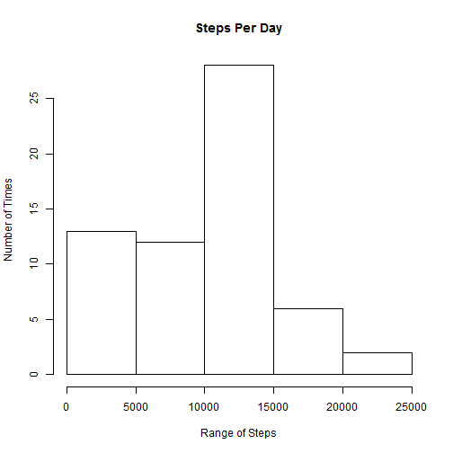
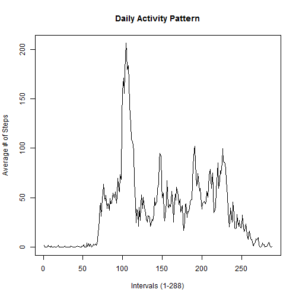
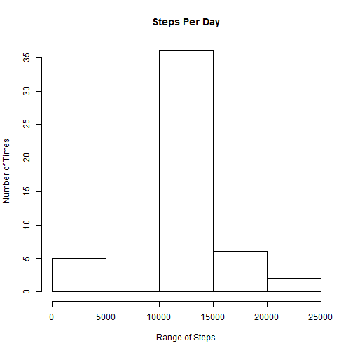
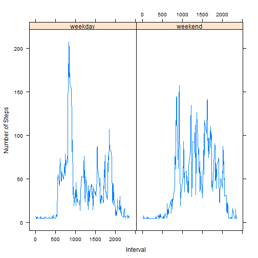

Load the activity.csv data by setting the working directory and reading it into R.

```r
setwd("C:/Users/Maloney/Desktop/Data/Activity")
data <- read.csv("activity.csv")
```
Calculate the total number of steps taken per day.

```r
steps_per_day <- tapply(data$steps, data$date, sum, na.rm=TRUE)
```
Create a histogram of the total number of steps per day. Calculate and report the mean and median of the total number of steps taken per day. 

```r
hist(steps_per_day, xlab = "Range of Steps", ylab = "Number of Times", main = "Steps Per Day")
```

 

```r
mean(steps_per_day)
```

```
## [1] 9354.23
```

```r
median(steps_per_day)
```

```
## [1] 10395
```
The mean number of steps is 9,354.23, and the median is 10,395 steps.

Now, make a time series plot of the 5-minute intervals and average number of steps taken, averaged across all days.

```r
steps_per_interval <- tapply(data$steps, data$interval, mean, na.rm=TRUE)
Activity_Pattern <- data.frame(steps_per_interval)
plot(Activity_Pattern, type="l", xlab="Intervals (1-288)", ylab="Average # of Steps", main = "Daily Activity Pattern")
```

 
On average, the 5-minute interval that contains the maximum number of steps is the 107th interval (835 minutes), at 206.17.

Now, count the number of missing values (NA) in the dataset. The total number of missing values is 2,304.

```r
sum(is.na(data))
```

```
## [1] 2304
```

Create new dataset that's identical to the original activity data, but replace all the missing "steps" observations with the mean number of steps per interval.

```r
new_data <- data
new_data$steps[which(is.na(new_data$steps))] <- mean(steps_per_interval)
```

Calculate the total number of steps taken per day now that missing values are filled in. Create a histogram of the total number of steps per day. Calculate and report the mean and median of the total number of steps taken per day. 

```r
new_steps_per_day <- tapply(new_data$steps, new_data$date, sum, na.rm=TRUE)
hist(new_steps_per_day, xlab = "Range of Steps", ylab = "Number of Times", main = "Steps Per Day")
```

 

```r
mean(new_steps_per_day)
```

```
## [1] 10766.19
```

```r
median(new_steps_per_day)
```

```
## [1] 10766.19
```
The adjusted mean AND median of the new data are 10,766.2. Filling in the missing values increased both measures and centered the distribution a bit more.

Now, create a new factor variable indicating whether a given day is a weekday or weekend day.


```r
new_data$date <- as.Date(new_data$date)
days <- weekdays(new_data$date)
new_data$weekend <- sapply(days, switch, Monday = 'weekday', Tuesday = 'weekday', Wednesday = 'weekday', Thursday = 'weekday', Friday = 'weekday', Saturday = 'weekend', Sunday = 'weekend')
```

Create a panel plot of the 5-minute interval and the average number of steps taken, averaged across all weekday days or weekend days.

```r
library(lattice)
result <- aggregate(steps ~ weekend + interval, new_data, mean)
xyplot(result$steps ~ result$interval | factor(result$weekend), type="l", xlab="Interval", ylab="Number of Steps")
```

 
